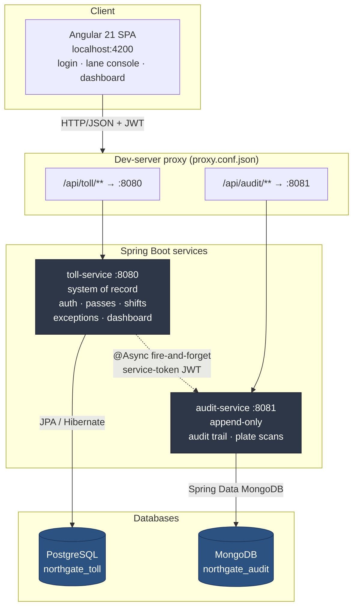
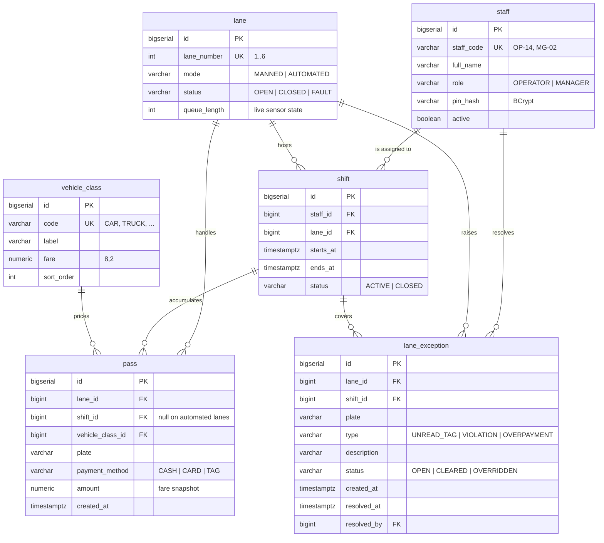
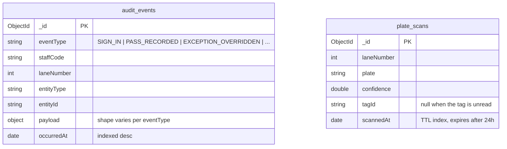

# Northgate Toll Plaza — Backend

Spring Boot microservices behind the Northgate Toll Plaza lane console and manager
dashboard. Two services, two databases, one shared signing secret.

**Stack:** Java 21 · Spring Boot 4.1 · Maven (multi-module) · PostgreSQL 18 · MongoDB 8 · Flyway · JJWT

---

## 1. Project Overview

Northgate Toll Plaza is a toll collection system for a six-lane plaza. Booth
operators sign in at a lane, classify each vehicle, take payment and open the
gate; plaza managers watch revenue, queues and lane faults in real time.

The backend is split along a single deliberate seam: **transactional toll
processing** versus **append-only observation**.

- `toll-service` is the system of record. Money, shifts, lanes and exceptions
  live here, in PostgreSQL, under ACID transactions.
- `audit-service` is the observer. It stores an immutable audit trail and raw
  ANPR plate scans in MongoDB, where each event type can carry a different
  payload shape without a schema migration.

Lanes, shifts, passes and exceptions deliberately stay in **one** service: they
share foreign keys and transactions, and splitting them would turn local joins
into network calls for no benefit.

The consistency trade-off is explicit: **tolls are ACID, audit is best-effort.**
`toll-service` publishes audit events asynchronously after its own transaction
commits. If `audit-service` is down, the failure is logged and dropped — a gate
never stays shut because the audit log is unavailable.

---

## 2. System Architecture



**Why no API gateway.** With two services and a single client, a gateway is
ceremony without payoff — the Angular proxy file *is* the routing table. If a
third service appears, introduce Spring Cloud Gateway and change only that file.

**Authentication.** `toll-service` issues an HS256 JWT at login carrying a
`role` claim (`OPERATOR` or `MANAGER`). Both services validate against the same
shared secret, so `audit-service` never makes an auth round-trip. For its own
outbound calls, `toll-service` mints a short-lived token with the `SERVICE` role
— which is what keeps the audit ingest endpoint closed to everyone else.

---

## 3. Microservice Breakdown

### `toll-service` — port 8080 — PostgreSQL

The system of record. Everything money-related and stateful.

| Concern | Responsibility |
|---|---|
| Auth | Staff code + PIN (BCrypt) → JWT with a role claim |
| Tariffs | Vehicle classes and fares (Motorcycle $1.50 … Truck $14.00) |
| Passes | Record a pass and snapshot the fare onto it; list the tail of the current shift |
| Exceptions | Open, clear and override lane exceptions (`UNREAD_TAG`, `VIOLATION`, `OVERPAYMENT`) |
| Shifts & lanes | Operator↔lane assignment, shift window and totals, lane status and queue depth |
| Dashboard | Plaza KPIs, per-lane stats and traffic-by-hour, computed with SQL aggregates |

Two details worth knowing before you change anything here:

- `pass.amount` is a **snapshot** of the tariff at the moment of the pass, not a
  reference to it. A later rate change must not rewrite what a driver was charged.
- Per-lane dashboard figures come from a `LEFT JOIN` off `lane`, so idle and
  closed lanes still appear in the grid instead of silently vanishing.

### `audit-service` — port 8081 — MongoDB

Append-only, schema-flexible, and losable without losing money.

| Concern | Responsibility |
|---|---|
| Audit trail | Immutable record of every business action, with a free-form `payload` |
| Plate scans | Raw ANPR reads with a confidence score, TTL-expired after 24 hours |
| Audit query | Manager-facing review, filtered by lane, staff or event type |

MongoDB earns its place here for a specific reason: a `SIGN_IN` event and a
`PASS_RECORDED` event carry completely different payloads, and neither should
require a migration to add a field.

---

## 4. Data Model

### PostgreSQL — `northgate_toll`



Constraints that carry real weight:

- `CREATE UNIQUE INDEX uq_shift_active_lane ON shift(lane_id) WHERE status = 'ACTIVE'`
  — one active shift per lane, enforced by the database rather than by hope.
- Money is `NUMERIC(8,2)` throughout. Never floats.
- Status columns are `VARCHAR` with `CHECK` constraints — portable and
  JPA-friendly, and readable in a `psql` session.

### MongoDB — `northgate_audit`



Indexes are created from annotations, which needs
`spring.data.mongodb.auto-index-creation: true` — already set. Compound indexes
cover `(laneNumber, occurredAt desc)` and `(staffCode, occurredAt desc)`.

---

## 5. Prerequisites

Verified against these versions:

| Tool | Version | Check |
|---|---|---|
| JDK | 21 (21.0.10 LTS) | `java -version` |
| Maven | 3.9+ (3.9.15) | `mvn -version` — or use the bundled `./mvnw` |
| PostgreSQL | 18+ (18.3) | `psql --version` |
| MongoDB | 8+ (8.3.7) | `mongosh --eval 'db.version()'` |

Both databases must be running locally before you start the services:

```bash
brew services start postgresql@18
brew services start mongodb-community
```

---

## 6. Installation & Setup

### Step 1 — Clone

```bash
git clone https://github.com/full-stack-dev-johncastrosanabria/NorthgateTollPlaza.git
cd NorthgateTollPlaza/northgate-backend
```

### Step 2 — Create the databases

`toll-service` needs its database to exist; Flyway creates the schema inside it.
MongoDB creates `northgate_audit` on first write.

```bash
createdb northgate_toll
createdb northgate_toll_test   # only needed to run the test suite
```

### Step 3 — Configure

Configuration lives in each service's `src/main/resources/application.yaml`, and
every value that differs per machine is an environment variable with a local
default. **The signing secret has no default** — the services fail fast rather
than start on a secret that is committed to a repository.

Copy the example file and fill it in:

```bash
cp ../.env.example ../.env
```

```bash
# .env
NORTHGATE_JWT_SECRET=<at least 32 characters — HS256 needs a 256-bit key>

# Optional; these fall back to local defaults when unset.
#NORTHGATE_DB_URL=jdbc:postgresql://localhost:5432/northgate_toll
#NORTHGATE_DB_USER=postgres
#NORTHGATE_DB_PASSWORD=
#NORTHGATE_MONGO_URI=mongodb://localhost:27017/northgate_audit
#NORTHGATE_AUDIT_URL=http://localhost:8081
```

Generate a secret with:

```bash
openssl rand -base64 32
```

> **Homebrew PostgreSQL** creates a role named after your OS user rather than
> `postgres`. Either set `NORTHGATE_DB_USER=$(whoami)` or use `../run.sh`, which
> does it for you.

The full settings, for reference:

| Property | Environment variable | Default |
|---|---|---|
| `northgate.jwt.secret` | `NORTHGATE_JWT_SECRET` | *none — required* |
| `northgate.jwt.expiration-minutes` | — | `480` (one shift) |
| `spring.datasource.url` | `NORTHGATE_DB_URL` | `jdbc:postgresql://localhost:5432/northgate_toll` |
| `spring.datasource.username` | `NORTHGATE_DB_USER` | `postgres` |
| `spring.datasource.password` | `NORTHGATE_DB_PASSWORD` | *(empty)* |
| `spring.mongodb.uri` | `NORTHGATE_MONGO_URI` | `mongodb://localhost:27017/northgate_audit` |
| `northgate.audit.base-url` | `NORTHGATE_AUDIT_URL` | `http://localhost:8081` |

> **Spring Boot 4 note.** The Mongo connection URI moved to `spring.mongodb.uri`.
> The Boot 3 key `spring.data.mongodb.uri` is silently ignored and every write
> lands in the default `test` database — a failure with no error message. Only
> `auto-index-creation` still lives under `spring.data.mongodb`.

### Step 4 — Build and run

```bash
set -a && source ../.env && set +a     # export the secret
./mvnw clean package                    # build both modules

java -jar toll-service/target/toll-service-0.0.1-SNAPSHOT.jar    &
java -jar audit-service/target/audit-service-0.0.1-SNAPSHOT.jar  &
```

Or from the workspace root, `./run.sh` starts both services and the frontend.

On first start, Flyway applies three migrations:

| Migration | Contents |
|---|---|
| `V1__schema.sql` | The six tables, indexes and constraints |
| `V2__seed.sql` | Demo staff, six lanes, five vehicle classes, today's shifts |
| `V3__demo_traffic.sql` | A plaza-scale day of traffic so the dashboard has something to aggregate |

**Demo accounts** — PIN `1234` for both:

| Staff ID | Name | Role | Lands on |
|---|---|---|---|
| `op-14` | R. Alvarez | OPERATOR | Lane console (lane 3) |
| `mg-02` | D. Okafor | MANAGER | Plaza dashboard |

> `V3` inserts roughly 1,500 rows of clearly-labelled demo traffic. Drop that
> migration before pointing this at anything real.

---

## 7. API Endpoints

Base URL for local development: `http://localhost:8080` and `http://localhost:8081`.
All endpoints except login expect `Authorization: Bearer <token>`.

### toll-service — `:8080`

| Method | URL | Role | Description |
|---|---|---|---|
| `POST` | `/api/toll/auth/login` | Public | Exchange staff code + PIN for a JWT and the operator's lane |
| `GET` | `/api/toll/vehicle-classes` | Any | Tariff table — classes and current fares |
| `GET` | `/api/toll/passes` | Any | The last 25 passes of the caller's active shift |
| `POST` | `/api/toll/passes` | `OPERATOR` | Record a pass, charge the fare and open the gate |
| `GET` | `/api/toll/shifts/current` | Any | Current shift summary — vehicles, collected, open exceptions |
| `GET` | `/api/toll/exceptions` | Any | Exceptions on the caller's lane |
| `POST` | `/api/toll/exceptions/{id}/override` | `OPERATOR` | Override an open exception and let the vehicle through |
| `GET` | `/api/toll/dashboard` | `MANAGER` | Plaza overview — KPIs, per-lane stats, traffic by hour |

### audit-service — `:8081`

| Method | URL | Role | Description |
|---|---|---|---|
| `POST` | `/api/audit/events` | `SERVICE` | Ingest a business event. Called only by toll-service |
| `GET` | `/api/audit/events` | `MANAGER`, `SERVICE` | Query the trail by `laneNumber`, `staffCode`, `eventType`, `limit` |
| `POST` | `/api/audit/scans` | Any | Record a raw ANPR plate read |
| `GET` | `/api/audit/scans/latest?laneNumber=3` | Any | Most recent scan for a lane, for the console's auto-read field |

### Try it

```bash
TOKEN=$(curl -s -X POST localhost:8080/api/toll/auth/login \
  -H 'Content-Type: application/json' \
  -d '{"staffCode":"mg-02","pin":"1234"}' | python3 -c "import json,sys;print(json.load(sys.stdin)['token'])")

curl -s localhost:8080/api/toll/dashboard -H "Authorization: Bearer $TOKEN" | python3 -m json.tool
```

Errors come back in a consistent envelope from `GlobalExceptionHandler`:

```json
{
  "timestamp": "2026-08-02T17:00:00.000-06:00",
  "status": 400,
  "error": "Bad Request",
  "message": "Validation failed",
  "fieldErrors": { "pin": "PIN must be 4 digits" }
}
```

---

## 8. Testing

```bash
./mvnw test          # 61 tests across both services
```

The suite needs PostgreSQL and MongoDB running, and `northgate_toll_test` to
exist. It supplies its own signing secret through Surefire, so no environment
setup is required.

| Suite | Covers |
|---|---|
| `DashboardServiceTest` | Overview assembly — lane counting, idle lanes, operator resolution |
| `DashboardAggregationTest` | The native SQL, against a real PostgreSQL |
| `AuthServiceTest` | Credential checks, lane resolution, uniform failure messages |
| `PassServiceTest` | Fare snapshotting, plate normalisation, audit payloads |
| `JwtServiceTest` | Real signing, tampering, expiry |
| `ControllerSecurityTest` | Every `@PreAuthorize` rule, end to end through MockMvc |
| `AuditEventServiceTest`, `PlateScanServiceTest`, `JwtAuthFilterTest` | The audit side |

`DashboardAggregationTest` runs against `northgate_toll_test` with
`spring.flyway.target=1`, so only the schema is applied and the demo seed does
not drown the fixtures. Every test rolls back.

Each suite was checked by mutating the code it covers and confirming the tests
fail. Two mutations initially survived and exposed vacuous assertions, which
were fixed — passing tests are not the same as effective ones.

---

## 9. Project Structure

```
northgate-backend/
├── pom.xml                       # parent: packaging=pom, Java 21, Boot BOM, Surefire env
├── mvnw, mvnw.cmd, .mvn/
├── toll-service/
│   └── src/main/java/com/john/northgate/toll/
│       ├── client/               # AuditClient — @Async, fire-and-forget
│       ├── config/               # SecurityConfig, JwtService, JwtAuthFilter
│       ├── controllers/          # Auth, Pass, Tariff, Shift, LaneException, Dashboard
│       ├── dto/                  # Records; XxxRequestDto / XxxResponseDto
│       ├── entity/               # Staff, Lane, Shift, VehicleClass, Pass, LaneException
│       ├── exception/            # GlobalExceptionHandler + typed exceptions
│       ├── repository/           # Spring Data JPA, with projections/ for aggregates
│       └── service/              # Auth, Pass, Shift, LaneException, Dashboard
│   └── src/main/resources/db/migration/   # V1 schema, V2 seed, V3 demo traffic
└── audit-service/
    └── src/main/java/com/john/northgate/audit/
        ├── config/               # SecurityConfig, JwtService (validate only), JwtAuthFilter
        ├── controllers/          # AuditEvent, PlateScan
        ├── document/             # @Document classes — the Mongo analogue of entity/
        ├── dto/, exception/, repository/, service/
```

The layering mirrors
[full-stack-dev-johncastrosanabria/spring-demo](https://github.com/full-stack-dev-johncastrosanabria/spring-demo):
`controllers` / `dto` / `entity` / `repository` / `service`, DTOs at the
boundary, bean validation, and a global exception handler — scaled up to a
multi-module build with two services.
