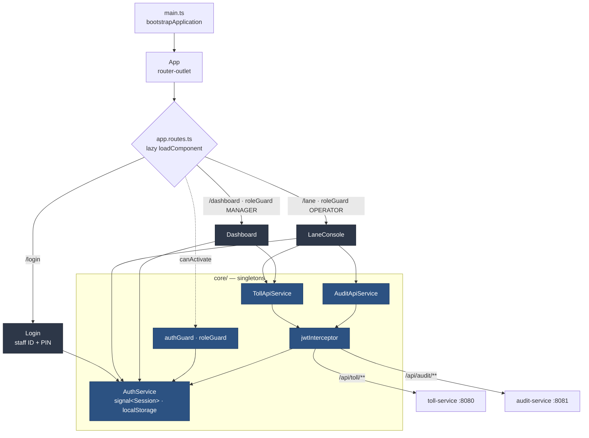
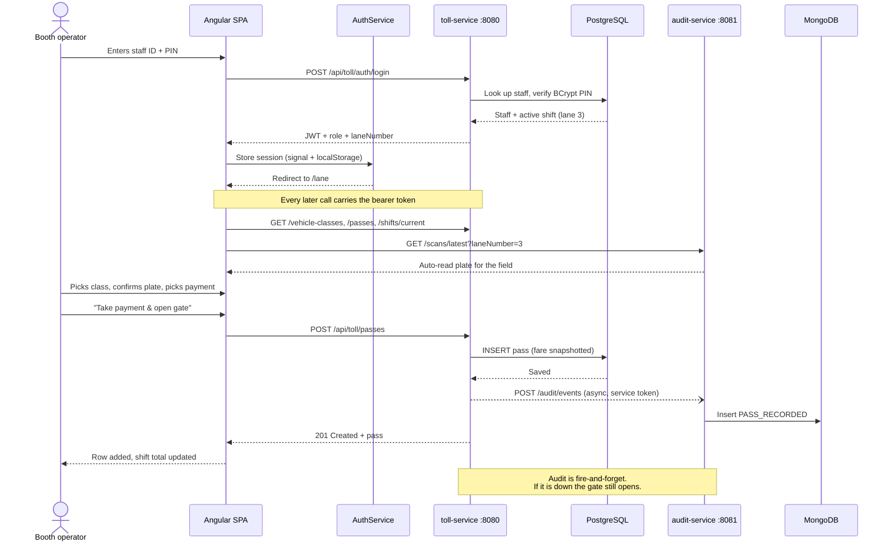

# Northgate Toll Plaza — Frontend

The Angular single-page application behind the Northgate Toll Plaza lane console
and manager dashboard.

**Stack:** Angular 21 · TypeScript · standalone components · signals · Vitest

---

## 1. Project Overview

One application, two audiences, separated by role at the router:

- **Booth operators** get the **lane console**: pick a vehicle class, read or type
  the plate, choose a payment method, take the fare and open the gate. Open
  exceptions for the lane sit alongside, each with an override action, and the
  running shift total is always visible.
- **Plaza managers** get the **plaza overview**: revenue and vehicles today, lanes
  open, vehicles queued, a card per lane with its operator and open exceptions,
  and a traffic-by-hour chart. It refreshes every 15 seconds.

The UI is built for a booth screen under time pressure: large numbers, a
monospace face for anything a person reads aloud (plates, staff IDs, money), and
a single unmistakable primary action per screen.

Architecturally it is deliberately plain — standalone components, signals for
state, lazily-loaded routes, no state-management library. There is not enough
shared state here to justify one.

---

## 2. Architecture & Component Tree



**How the pieces divide up:**

| Unit | Responsibility |
|---|---|
| `App` | Shell. A `router-outlet` and nothing else |
| `Login` | Staff ID + PIN, then redirect to the role's home route |
| `LaneConsole` | The operator screen: new pass, exceptions, recent passes, shift totals |
| `Dashboard` | The manager screen: KPIs, lane grid, traffic chart, 15s polling |
| `AuthService` | Session as a signal, persisted to `localStorage`, survives refresh |
| `TollApiService` / `AuditApiService` | Typed wrappers over the two backends |
| `authGuard` / `roleGuard` | Route protection; wrong role is redirected to its own home, never a dead end |
| `jwtInterceptor` | Attaches the bearer token; signs out on 401/403 |

`roleGuard` redirects rather than blocking: a manager who lands on `/lane` is
sent to `/dashboard`, not shown an error. The one case that is deliberately *not*
a logout is a rejected sign-in — a wrong PIN must surface as a form error rather
than bouncing through the interceptor.

---

## 3. User Flow

An operator signing in and recording a single pass, end to end:



---

## 4. Prerequisites

| Tool | Version | Check |
|---|---|---|
| Node.js | 20+ (verified on 24.12.0) | `node --version` |
| npm | 10+ (verified on 11.6.2) | `npm --version` |
| Angular CLI | 21.x | `npx ng version` |

The CLI is a project dev-dependency, so `npx ng` works without a global install.
If you prefer one: `npm install -g @angular/cli@21`.

**The backend must be running.** See `../northgate-backend/README.md`. Without
it the app loads and the login form rejects every attempt.

---

## 5. Installation & Setup

### Step 1 — Install

```bash
git clone https://github.com/full-stack-dev-johncastrosanabria/NorthgateTollPlaza.git
cd NorthgateTollPlaza/northgate-frontend
npm install
```

### Step 2 — Point at the backends

All HTTP calls use root-relative paths (`/api/toll/...`, `/api/audit/...`), so
there is no base URL compiled into the bundle. In development the dev-server
proxy routes them; in production a reverse proxy does the same job.

`proxy.conf.json` is the routing table:

```json
{
  "/api/toll":  { "target": "http://localhost:8080", "secure": false, "changeOrigin": true },
  "/api/audit": { "target": "http://localhost:8081", "secure": false, "changeOrigin": true }
}
```

Change the `target` values if your services run elsewhere. Because paths are
relative, this is also what keeps the browser same-origin — there is no CORS
configuration on either service, by design.

### Step 3 — Run

```bash
npm start          # or: npx ng serve
```

The app is served at **http://localhost:4200** and opens on the login screen.

**Demo accounts** — PIN `1234` for both:

| Staff ID | Role | Lands on |
|---|---|---|
| `op-14` | Booth operator | `/lane` — the lane console |
| `mg-02` | Plaza manager | `/dashboard` — the plaza overview |

---

## 6. Build

```bash
npm run build              # production build → dist/northgate-frontend/
npx ng build --configuration development   # unminified, with source maps
```

Deploying the output needs two things from the host:

1. **SPA fallback** — rewrite unknown paths to `index.html`, or a refresh on
   `/dashboard` returns a 404.
2. **A reverse proxy** for `/api/toll` and `/api/audit`, matching what
   `proxy.conf.json` does in development.

An nginx sketch:

```nginx
server {
    root /var/www/northgate-frontend/browser;
    location /            { try_files $uri $uri/ /index.html; }
    location /api/toll/   { proxy_pass http://127.0.0.1:8080; }
    location /api/audit/  { proxy_pass http://127.0.0.1:8081; }
}
```

---

## 7. Testing

```bash
npm test                       # 26 tests
npx ng test --watch=false      # single run, for CI
```

Angular 21 runs specs on **Vitest**, not Karma/Jasmine — spies are `vi.fn()`, and
Jasmine-style specs will not port unchanged.

| Spec | Covers |
|---|---|
| `auth.service.spec.ts` | Session restore across refresh, corrupt-storage recovery, login, logout, role routing |
| `jwt.interceptor.spec.ts` | Token attachment, logout on 401/403, and *not* on a rejected sign-in |
| `auth.guard.spec.ts` | Both roles reaching their own screen; redirects instead of dead ends |
| `dashboard.spec.ts` | KPI rendering, unmanned lanes, bar scaling, empty and error states |

`src/test-setup.ts` installs an in-memory `localStorage`. The test environment
is jsdom under Node, and Node's own experimental `localStorage` global is
disabled without `--localstorage-file`, so the real one is simply absent.
That scaffolding is test-only; browsers provide the genuine article.

---

## 8. Project Structure

```
northgate-frontend/
├── proxy.conf.json                 # /api/toll → :8080, /api/audit → :8081
├── src/
│   ├── test-setup.ts               # in-memory localStorage for Vitest
│   └── app/
│       ├── app.ts / app.routes.ts / app.config.ts
│       ├── core/
│       │   ├── api/                # toll-api.service.ts, audit-api.service.ts
│       │   └── auth/               # auth.service.ts, auth.guard.ts, jwt.interceptor.ts
│       ├── features/
│       │   ├── login/
│       │   ├── lane-console/
│       │   └── dashboard/
│       └── shared/models/          # session, pass, lane, vehicle-class, dashboard
```

Routes are lazily loaded with `loadComponent`, so an operator never downloads the
dashboard bundle and a manager never downloads the console.
